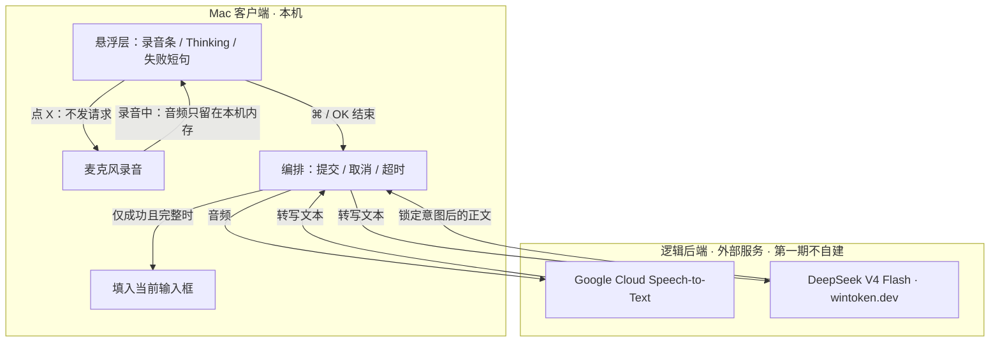
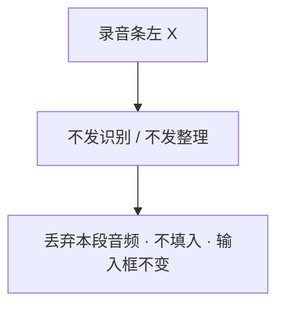
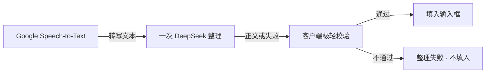

# SayClear — 后端技术架构

> 本文是第一期**已锁定的架构说明**，不是实现、不是开发教程。  
> 功能行为以 [`SayClear-功能需求文档.md`](./SayClear-功能需求文档.md) 为准；交互以 `docs/prototype/` 为准。  
> 密钥只放本机 [`.env`](../.env)（git 忽略），**本文不写密钥**。

---

## 1. 文档信息

| 项 | 内容 |
|---|---|
| 文档状态 | **仅架构、未开发**。可读、可评审；不代表已开工。 |
| 产品名 | SayClear |
| 日期 | 2026-09-03（按实测锁定厂商） |
| 读者 | 产品、开发 |
| 范围 | 第一期：口述从录音结束到「锁定意图正文」之间的逻辑后端，以及它与 Mac 客户端的分工 |
| 不在本文 | 业务代码、脚手架、产品开发 |
| **语音识别** | Google Cloud Speech-to-Text V2；细则 [`SayClear-语音识别接入.md`](./SayClear-语音识别接入.md) |
| **文本整理** | DeepSeek V4 Flash（`deepseek-v4-flash-0731`）via wintoken.dev；做法见 **第 5 节** |

### 1.1 本文立场

- **第一期不自建后端服务。** 推荐 Mac 客户端直连外部「语音识别」与「文本整理」API。下文把这两类外部能力合称为**逻辑后端**。
- 用户已接受口述离开本机、交给外部识别 / 整理服务。架构不再把「本机 / 外传」做成开关。
- 五个整理能力必须全部生效，但对用户仍是一次 Thinking、一次填入。
- **语音识别已定为 Google Cloud Speech-to-Text V2。** 只做音频 → 转写，不做清洗 / 分点。
- **文本整理已定为 DeepSeek V4 Flash（wintoken.dev）。** 只吃转写文本，一次调用完成五个能力，产出可填入正文。

### 1.2 已锁定栈（2026-09-03 实测可通）

| 段 | 已定 |
|---|---|
| 形态 | 第一期 **不自建服务器**。Mac 客户端直连下面两个外部 API |
| **语音** | **Google Cloud Speech-to-Text API V2**，项目 **`sayclear`** |
| 语音怎么接通 | 本机 **ADC**（`gcloud auth application-default login`），**不用**控制台 API key。调用 **HTTPS REST** `Recognize`（整段录音结束后一次）。本机 gRPC 客户端曾握手失败，REST 已 200 |
| 语音产品配置 | 模型 **`chirp_3`**，区域 **`us`**，语言 `cmn-Hans-CN` + `en-US`；识别器 `projects/sayclear/locations/us/recognizers/_` |
| 语音密钥位置 | 项目 ID 在 `.env` 的 `GOOGLE_CLOUD_PROJECT`；登录凭证在本机 ADC，不进 git |
| **整理** | **DeepSeek V4 Flash**，模型名 **`deepseek-v4-flash-0731`** |
| 整理怎么接通 | OpenAI 兼容：`POST https://wintoken.dev/v1/chat/completions`，头 `Authorization: Bearer <token>`。token 只在 `.env` 的 `CUN_AI_API_KEY` |
| 整理调用策略 | **一次** chat 完成；第一期 **`thinking.type = disabled`**（缩短 Thinking 等待）。输入 = 转写全文 + 固定系统指令；输出 = 一段纯正文 |
| 连通结论 | 语音：示例音频 + 麦克风测试通过。整理：短请求返回「在线」。**两条尚未串成产品流程** |

### 1.3 与需求 / 原型

对照需求与原型后，**没有需要改交互的矛盾**。两点仅作架构阅读注释，不回改产品：

1. 需求文档的失败态写在 **§8.4**（第 8 节是快捷键与悬浮层）。下文「对齐第 8 节」均指 §8.4。
2. 原型只画出「无麦克风权限」「没有可填入框」两种失败；识别/整理失败、没录到声音、填入失败仍按需求存在，由本文覆盖，不要求先改原型。

---

## 2. 系统边界

SayClear 第一期是 **Mac 桌面悬浮工具**，不是网站、不是浏览器插件、不是输入法。所谓「后端」，第一期主要是**逻辑后端**（外部识别 + 外部整理），不是自建的应用服务器。



### 2.1 在 Mac 客户端里的事

| 能力 | 说明 |
|---|---|
| 全局 ⌘ 单击切换 | 开始 / 结束录音；与点 OK 同类 |
| 录音与波形 | 暗黑圆角胶囊；录音期间**不**把半句转写填进输入框 |
| 左 X | 取消本次：不识别、不整理、不填入 |
| Thinking | 只显示 Thinking；等待逻辑后端整段完成 |
| 填入 | 把锁定后的正文写入**当前可填入输入框**；不代发、无成功 toast、无「打开修改」 |
| 失败展示 | 短句说明原因与下一步；不把失败信息当正文填入 |
| 编排与守卫 | 何时发请求、何时中止、超时、校验「结果是否可填入」 |

麦克风权限、有没有可填入框、辅助功能写入是否成功，都是**本机问题**，逻辑后端看不到，也不该假装看到。

### 2.2 算「后端」的事（逻辑后端）

| 能力 | 说明 |
|---|---|
| 语音 → 文字 | **Google Cloud Speech-to-Text（已定）**。只负责音频 → 转写 |
| 文字 → 锁定意图正文 | **DeepSeek V4 Flash**（wintoken.dev）。一次调用产出锁定意图正文 |
| 失败语义 | 识别失败、整理失败、超时、空结果 / 不可用结果：返回失败，**不附带可填入正文** |

逻辑后端**不**负责：选目标 App、判断是 Prompt 还是搜索、弹确认层、代发、存历史。

### 2.3 明确不在第一期系统里的东西

自建 API 网关、账号与鉴权中台、数据库、对象存储、消息队列、多租户、管理后台、Windows / 移动端服务。见第 9 节。

---

## 3. 推荐方案：第一期不要自建服务

### 3.1 结论（先读这几句）

1. **第一期不部署自有后端进程。** 没有账号、没有历史、没有多端同步，自建一层服务几乎只为「转发 HTTP」付运维成本。
2. **Mac 客户端直连两类外部 API**：识别一次、整理一次。密钥放在本机（钥匙串 / 本地配置），不进仓库、不进逻辑后端日志。
3. 对产品而言，这两类 API **就是后端**。架构图画的是这条逻辑链，而不是一台我们自己的服务器。
4. 若以后要用**产品方统一密钥**且密钥不能下发到安装包，再加一层很薄的转发。那是演进，不是第一期必做。

### 3.2 三种后端形态对比

| | A. 客户端直连（推荐第一期） | B. 自建薄转发 | C. 自建平台 |
|---|---|---|---|
| 形态 | App 直接调识别 API、整理 API | 自有一个很小的 HTTPS 服务，只转发、藏密钥、统一超时 | 队列、落库、账号、多租户、可观测平台等 |
| 第一期要不要自建服务 | **不要** | 要（一台小服务） | 要（一套平台） |
| 与产品匹配 | 无账号、无历史、单机 Mac、用户接受调 API | 适合「公司统一付识别/整理费、密钥不能进客户端」 | 远超第一期边界 |
| 密钥 | 本机配置或用户自备；钥匙串保存 | 密钥只在服务器；客户端最多持有设备/会话凭证 | 通常还要账号体系 |
| 超时 / 取消 | 客户端中止两次调用，丢弃迟到响应 | 转发层也可中止上游，但仍需客户端丢弃 | 队列任务难以「点 X 立刻作废」 |
| 失败不填半成品 | 客户端校验：非成功完整正文一律不填 | 同样依赖客户端不填；转发层可统一成一种错误包 | 容易出现「半段落库再回填」，与需求冲突 |
| 成本与节奏 | 最低；先把主链路做对 | 中：域名、证书、进程、防滥用 | 高：第一期不应选 |
| 主要风险 | 安装包若内置公司密钥会被取出；厂商接口变更要发版 | 无账号时转发层易被刷；等于提前引入服务运维 | 范围膨胀、Thinking 更慢、还要存数据 |
| 何时采用 | **第一期默认** | 统一密钥不能下发、或要热切换厂商而不发版 | 有账号 / 历史 / 多端之后再评估 |

### 3.3 为何第一期选 A

- 需求已定：口述交给外部识别 + 整理；第一期无账号、无历史、「打开修改」不做。
- 主链路短：录音结束 → 音频 → 识别 → 整理 → 正文 → 填入。中间没有需要服务端协调的多用户状态。
- 取消语义简单：X 发生在录音结束前则**根本不发请求**；若已在 Thinking，客户端中止即可。自建队列反而更难「作废进行中的一次」。
- 失败策略是客户端职责：任何非完整成功都不得填入。薄转发帮不了「有没有输入框」「辅助功能写没写进去」。

**不选 B 的第一期理由：** 薄转发的真实价值是藏密钥和换厂商。第一期可以用本机密钥（开发者配置或用户自备）起步。一旦采用 B，在无账号前提下必须另做防滥用（否则任何人都能打你的转发接口），等于提前引入本不必存在的安全面。

**不选 C 的理由：** 与第 10 节非目标直接冲突（账号、多租户、队列平台、历史）。

### 3.4 推荐形态下的逻辑后端怎么组成

即使没有自建服务，逻辑后端仍是两段、缺一不可：

| 段 | 占位名 | 输入 | 输出 | 已定服务 |
|---|---|---|---|---|
| 1 | 语音识别服务 | 本次录音的音频 | 转写文本，或识别失败 | **Google Cloud Speech-to-Text（已定）** |
| 2 | 文本整理服务 | 转写文本 + 固定系统指令 | **锁定意图后的纯正文**，或整理失败 | **DeepSeek V4 Flash** · `POST {CUN_AI_BASE_URL}/chat/completions` |

客户端是唯一编排者：

1. 录音结束（⌘ 或 OK）且未取消 → 才把**整段音频**交给识别服务（第一期用结束后的整段，不做边说边出字；需求不要求预览逐字稿，也禁止半句入框）。
2. 识别成功得到非空转写 → 再把文本交给整理服务。**一次整理调用**覆盖五个功能（见第 5 节「文本整理技术路线」）。
3. 整理成功且正文通过「可填入」校验 → 才交给填入模块。识别成功但整理失败时，**转写不得填入**。

### 3.5 密钥、超时、失败（无自建服务时仍要说清）

**密钥**

- 识别、整理各有自己的访问凭证；第一期只存在本机。开发机：识别走 ADC；整理走 `.env`。产品安装包阶段再改钥匙串 / 服务账号 JSON。
- 识别：**不要用 Google API key**。本地试调 ADC；产品再考虑服务账号 JSON。见 [`SayClear-语音识别接入.md`](./SayClear-语音识别接入.md)。
- 整理：Bearer token 只在 `.env` 的 `CUN_AI_API_KEY`，对应 `CUN_AI_BASE_URL=https://wintoken.dev/v1`、`CUN_AI_MODEL=deepseek-v4-flash-0731`。
- 不进 git、不写进失败文案、不出现在悬浮层。
- 客户端只用 HTTPS 调厂商；本文不写具体鉴权头格式。
- 演进信号：若改为产品方统一付费且密钥不能出现在客户端，再评估形态 B。

**超时**

- 识别、整理**各自**超时；另设一次口述的**总等待上限**（Thinking 期间）。
- 任一超时 = 本次失败。不把「识别已出、整理未出」的转写填入。
- 超时后客户端必须中止进行中的调用，并**丢弃迟到响应**（避免 Thinking 已收起后突然填入）。
- 具体秒数实现时再定；架构只要求：上限短到用户愿意等、长到普通中英口述够用。需求里「极长口述是否截断」仍待确认——未拍板前，过长按失败或「请分段说」，不要默默截断后当成功。

**失败**

- 逻辑后端只应给出两类结局：**完整可用正文**，或**失败（无正文）**。
- 客户端是最后一道闸：空串、整理模型扮演前缀（「我理解你的需求是」）、明显未完成稿、截断残句，一律当失败，不填入。用户说的短确认语不是失败。详见第 7 节。

---

## 4. 逻辑架构图

主链路（成功路径）。用户看见的只有：录音条 → Thinking → 输入框里出现正文。

```mermaid
sequenceDiagram
  autonumber
  actor U as 用户
  participant C as Mac 客户端
  participant STT as Google Speech-to-Text
  participant ORG as DeepSeek V4 Flash
  participant Box as 当前输入框

  U->>C: ⌘ 开始录音
  C-->>U: 暗黑圆角胶囊 + 波形
  U->>C: ⌘ 或 OK 结束
  C-->>U: 只显示 Thinking
  C->>STT: 本次音频
  STT-->>C: 转写文本
  C->>ORG: 转写文本（一次整理）
  ORG-->>C: 锁定意图后的正文
  C->>C: 校验可填入（非空、非话术、非半成品）
  C->>Box: 填入正文
  C-->>U: 悬浮层收起 · 无 toast · 不代发
```


取消不走这条链：



Thinking 与逻辑后端的关系：Thinking **不是**某一步的名字，而是「识别 + 整理尚未得出可填入正文」的等待态。

---

## 5. 文本整理技术路线

> 给产品与开发拍板用。本节只写：**转写文本 → 锁定意图正文**。  
> 功能需求文档 §5.1–5.5 的五个能力必须全部生效，但**不是**五次模型调用。可运行的长 prompt 不写在这里，实现时按下方要点清单落地。

### 5.1 边界：识别是黑盒，整理从转写开始

| 段 | 第一期约定 |
|---|---|
| 语音识别 | **Google Cloud Speech-to-Text（已定）。** 仍当「音频 → 转写文本」黑盒：成功则交出一段口语转写，失败则无转写。不在识别侧做清洗、纠错、分点。接入见 [`SayClear-语音识别接入.md`](./SayClear-语音识别接入.md)。 |
| 文本整理 | **DeepSeek V4 Flash**（`deepseek-v4-flash-0731`，wintoken.dev）。只吃转写文本，产出可填入的正文。不是 Google。 |
| 音频 | **第一期不要把音频直接丢给整理模型。** 链路固定为：识别 API → 文本 → 整理。端到端（音频进、正文出）是以后的选项，不是本期。 |
| 当前 App | 整理看不见、不判断是 AI 还是搜索；同一套规则。 |

识别失败 → **不发起整理**，本次按失败处理，不填入。  
识别成功（得到非空转写）→ **才**发起这一次整理。

### 5.2 推荐路线：识别完成后，整段转写「一次」整理

**第一期采用：识别成功后，对整段转写做一次整理调用。** 功能需求文档 §5.1–5.5 的五个能力写进**同一次系统侧指令**，由模型在一次往返里完成；客户端再做极轻校验后填入。



产品上的规则顺序（功能需求文档 §6）仍是：先按最终说法收拢改口，再清洗，再判断分点，再落成段落或 `1. 2. 3.`，最后锁定为可填正文。那是**指令内部的先后**，不是五次网络调用。

| 步骤 | 落在哪 | 调用次数 |
|---|---|---|
| 语音 → 文字 | Google Cloud Speech-to-Text | **1** |
| 智能纠错、语义清洗、智能分点、智能格式化、意图确认 | DeepSeek V4 Flash 一次 chat | **1**（同一次指令内） |
| 可填入校验 | 仅客户端 | 0 次模型 |
| 填入当前输入框 | 仅客户端 | 0 次后端 |

**一次调用的理由（拍板用）：**

1. **延迟：** 用户在 Thinking 里等的是「识别 + 这一次整理」。串五次模型会把等待叠五倍，失败面也放大。
2. **结果一致：** 分点、格式化、锁定意图必须看见同一份已收拢的意思；拆成多次容易前后稿对不齐。
3. **改口信号不能被提前吃掉：** 若先用规则或另一次调用洗掉「不对 / 算了」，后续纠错就丢了覆盖依据。五个能力必须共享原文。

以后若单次质量不够，允许演进为「纠错+清洗」与「分点+格式化+锁定」**两次**调用；对外仍是一次提交、一次正文。第一期按一次做。

### 5.3 路线对比（第一期只选一列）

| | **一次 LLM 整理（推荐）** | 分步多次调用 | 纯规则（正则去口头禅） |
|---|---|---|---|
| 做法 | 识别后 1 次整理；五能力写在同一指令里 | 按需求 5.1–5.5 各调一次（或纠错/清洗拆开） | 关键词表删除「嗯 / 那个」等 |
| Thinking | 识别 + **一次**整理 | 识别 + 多次串行，明显更长 | 很快，但过不了纠错 / 分点 |
| 一致性 | 同一上下文，条目与段落一次成形 | 前一步输出可能改写或丢掉后一步还要用的信号 | 无语义，谈不上锁定意图 |
| 改口 | 指令要求「先收拢再清洗」，原文仍在 | 若清洗先跑，改口词被删，纠错失效 | 几乎做不到「只留最终说法」 |
| 中英 / 专有词 | 靠模型能力保留原词 | 每步都可能被改写 | 容易误删 `timeout`、`hover` |
| 第一期 | **采用** | 不采用 | **只用在客户端极轻校验**（空、过短），不当主整理 |

### 5.4 整理用哪家、怎么操作（已定）

| 项 | 已定 |
|---|---|
| 模型 | `deepseek-v4-flash-0731`（DeepSeek V4 Flash，版本 0731） |
| 网关 | `https://api.deepseek.com/v1`（DeepSeek 官方；不再走 wintoken） |
| 接口 | `POST /chat/completions` |
| 鉴权 | `Authorization: Bearer`，值只从 `.env` 读，**不写进代码** |
| 思考模式 | **关闭。** `thinking: { "type": "disabled" }`，并带 `reasoning_effort: "none"`。V4 默认开深度思考；整理只要快速出正文 |
| 温度 | 整理要稳，建议 `temperature` 偏低（约 0.2～0.4） |
| 输入 | `system`：§5.6 固定规则；`user`：整段 Google 转写原文 |
| 输出 | `choices[0].message.content` 当作要填入的正文（若将来强制 JSON，只取 `text` 字段，见 §5.7） |
| 不做 | 不把音频发给 DeepSeek；不把当前 App 名发给 DeepSeek；不按 ChatGPT / 搜索换两套 prompt |

**对用户输入文字实际做的事（一次调用内）：**

1. 收到的是语音识别后的**口语转写**（可含嗯、改口、中英夹杂、多件事搅在一起）。
2. 模型按固定规则：先收拢改口，再去掉口头禅，再决定分点还是写通顺，最后只输出能直接贴进输入框的正文。
3. 客户端再做空串 / 话术前缀等极轻校验；过了才填入。

选型时仍要保证这三项能力（模型已选，验收时核对）：

| 需要的能力 | 对应需求 | 过不了会怎样 |
|---|---|---|
| **中英混合** | 同一段口述里中文 + 英文术语 / 代码词；专有名词原样 | 把 `button` / `padding` 译掉或删掉 |
| **改口** | 理解「不对 / 算了 / 不是…是…」是覆盖，不是并列；也能区分「对了，标题也改」是补充 | 新旧说法并存，或把补充误删 |
| **分点判断** | 两个及以上独立需求 / 步骤才分点；一件事或连贯叙述走段落 | 单句硬拆成 `1.`，或三条改点挤成一句 |

另：输出必须能收敛成**一段纯正文**（不是聊天回复、不是解释过程）。程度词、无标记改口、极长口述等需求待确认项：未拍板前按需求默认（从宽保留语气；无明确否定则从宽都留；过长不要默默截断当成功）。

### 5.5 输入 / 输出

整理服务只看见**文本**，不看见音频、不看见当前 App。

**输入**

| 项 | 约定 |
|---|---|
| 转写文本 | 识别 API 返回的整段口语，可含中英、口头禅、改口、重复 |
| 系统侧指令 | 固定规则（见 §5.6），不是按 App 切换的模板 |

**输出（成功）**

唯一一段**可填入输入框的纯文本正文**：

- 多条并列需求或步骤 → `1. 2. 3.`（或等价的通顺分点纯文本）
- 一件事或连贯叙述 → 通顺段落，不强行分点
- **禁止**「我理解你的需求是……」「以下是给你的 Prompt：」及同类确认 / 扮演前缀
- 不要第二份「解释 / 思考过程」给用户看

**输出（失败）**

无可用正文。原因归到第 7 节失败类，不写厂商接口名，也不把转写原文填入。

**成功形态（与需求场景一致，仅说明契约）**

- 改口后的单请求 → 「写一个 TypeScript 脚本，读取 CSV 并输出 JSON。」
- 多条并列 → 「1. 把 button 改小\n2. 调整 padding\n3. 把 hover 状态的颜色调亮」

### 5.6 系统侧指令要点（对应需求 5.1–5.5）

实现时可写成系统指令或等价约束。**不要把下面当成可运行 prompt 全文**；落地时保持同一份固定规则，不按目标 App 改模板。

1. **先纠错、再清洗：** 有「不对 / 算了 / 不是…是… / 改成」等信号时只留最终说法；不要先删口头禅以致改口信号消失。后说的是补充（如「对了，标题也改」）则两条都留；无明确否定时从宽都留，不猜测删前半句。
2. **语义清洗：** 去掉口头禅、垫话、无意义重复；保留对象、动作、条件、顺序词（然后 / 但是 / 因为）以及用户真正要说的信息。
3. **不扩写：** 不新增用户没说过的需求、背景、角色设定、输出格式要求；不改成「请作为资深专家……」。
4. **专有词原样：** 中英混合里的专有名词、代码标识符、英文术语、数字不翻译、不改写、不删。
5. **分点判断：** 两个及以上互相独立的需求 / 问题 / 改点 / 步骤才分点；单一请求或连贯叙述不分点。
6. **格式化：** 分点用 `1. 2. 3.`；否则通顺段落。任意输入框同一套逻辑。允许把「按钮太大了」收成「缩小按钮尺寸」这种同义、更利落的写法，不得改成相反或额外需求。
7. **锁定意图：** 只输出可直接使用的正文。禁止确认话术前缀，不向用户反向提问；歧义时仍给当前最佳锁定结果。
8. **失败宁可空：** 转写为空、明显没说完、或整段只有「嗯 / 那个 / 啊」这类没有交际意图的垫话时，不要编一段需求充数（客户端也会当失败，见 §5.8）。用户要对着输入框说的短确认、应答（「好的」「是的」「可以」「收到」等，不限于这两个词）是正文，必须输出，不得当垃圾词清空。

程度副词与情绪词：拍板前默认**不因为「更专业」而删**。极长口述：未拍板前不要默默截断后当成功。

### 5.7 输出约定（给对接用）

第一期 schema 尽量薄：

| 约定 | 说明 |
|---|---|
| 优先 | 接口直接返回**一段正文字符串**（就是要填入的那一段） |
| 若必须包一层 | JSON **只允许一个字段** `text`（字符串）。客户端**只填 `text`**，忽略其它键 |
| 不要 | 多字段 schema（`items[]`、`confidence`、`mode`、`thinking`、分点对象数组等） |
| 用户看见的 | 永远是纯文本；即使厂商返回了 JSON，填入框的也只能是 `text` 里的正文 |

选「直接正文」还是 `{ "text": "..." }` 由具体整理 API 的形态决定；产品契约只有一个：最终填入的是那一段字符串。

### 5.8 校验、Thinking、与识别的衔接

**客户端极轻校验（规则，不是第二轮模型）**

通过才填入；否则当整理失败，**不填入**：

- 空、只含空白
- 过短到不像一句完整意思（与「没录到声音」区分：已有转写但仍不可用 → 走整理失败）
- 明显未完成（截断残句、半个 `1.` 没有后续）
- 只有扮演前缀（「我理解你的需求是」等），剥掉前缀后若仍无实质正文也失败。用户自己的短确认语（好的、是的、可以等）算实质正文。

不做深度语义再判断；深度整理已经在那一次模型调用里完成。

**Thinking**

客户端在等的是 **「识别 + 这一次整理」**（外加本机校验），用户只看到 Thinking，不可见子步骤，也不先填转写再换成整理稿。

**X 取消**

- 仍在录音：不发起识别，也就**不发起整理**。
- 已进入 Thinking：中止进行中的识别 / 整理，**丢弃**这次整理的迟到响应，不填入。

**和识别的衔接（第一期）**

| 情况 | 整理 | 填入 |
|---|---|---|
| 识别失败 / 超时 / 空转写 | **不调用**整理 | 否 |
| 识别成功 | **一次**整理（整段转写） | 仅整理成功且校验通过 |
| 识别成功、整理失败或超时 | — | 否（转写也不得填入） |
| 把音频直接给整理模型 | **第一期不做** | — |

识别服务的契约到转写为止：音频进、转写出。空 / 过短 / 无语音不当作整理输入，走「没录到声音」或识别相关的整理失败（见第 7 节）。

---

## 6. 接口级说明（逻辑 API，不是代码）

下面是客户端与逻辑后端之间的**操作契约**。形态 A 下它们不是自有 HTTP 路径，而是客户端编排的两次外部调用；形态 B 下可以收成一个自有入口。第一期按 A 理解即可。

整理「怎么做」以第 5 节为准；本节只写何时提交、取消、Thinking 在等哪一段。

### 6.1 提交一次口述

| 项 | 约定 |
|---|---|
| 何时 | 录音已结束（再按 ⌘ 或点 OK），且本次未被 X 取消 |
| 主路径入参 | **音频**（本段录音）。产品没有「打字 / 粘贴乱口语再整理」，因此没有用户侧的「只交转写」入口 |
| 允许的内部形态 | 编排上拆成「音频 → 转写」「转写 → 正文」两步；对产品仍是一次提交 |
| 成功出参 | 锁定意图后的正文（一个字符串） |
| 失败出参 | 失败类别 + 无可用正文 |
| 副作用 | 第一期**无**：不落库、不建会话、不通知其它设备 |

不要在提交时附带「当前是 AI 还是搜索」。整理不得依赖该信息。

### 6.2 返回锁定意图后的正文

| 项 | 约定 |
|---|---|
| 什么算返回成功 | 正文已通过可填入校验 |
| 客户端接着做什么 | 写入当前可填入输入框；收起悬浮层；无 toast；不代发 |
| 什么不算成功 | 识别失败、整理失败、超时、空结果、话术腔、半成品；以及「有正文但当前没有输入框 / 写入失败」（后两者是客户端失败，见 §8.4） |

「锁定意图」是整理链的收敛结果，**不是**单独的确认接口，也不是用户再点一次 OK。

### 6.3 取消（X）：不发请求或丢弃进行中的请求

| 时机 | 逻辑后端应发生什么 |
|---|---|
| 仍在录音，点 X | **不发**识别、**不发**整理。本段音频作废。输入框不变 |
| 已进入 Thinking（产品若确认「整理中可取消」） | **中止**进行中的识别 / 整理；**丢弃**之后到达的任何响应，即使厂商已经计费 |
| 迟到响应 | 必须带「本次口述世代 / 令牌」：过期令牌的成功正文也**禁止**填入 |

需求对「Thinking 时再按 ⌘」仍待确认。架构预留中止能力，默认建议与 X 同类（作废、不填入），拍板前不把它写成已上线交互。

### 6.4 Thinking 期间客户端在等哪一步

Thinking 覆盖逻辑后端的**整段**（识别 + **一次**整理），用户不可见子步骤。细则见 §5.8。

| 阶段 | 客户端在等 | 用户看到 |
|---|---|---|
| 识别中 | 语音识别服务返回转写或失败 / 超时 | Thinking |
| 整理中 | 文本整理服务返回正文或失败 / 超时 | 仍是 Thinking |
| 校验中 | 本机判断正文是否可填入 | 仍是 Thinking |
| 全部成功 | 进入填入 | Thinking 结束，正文出现在输入框 |
| 任一步失败 | 进入失败短句 | 不是 Thinking |

第一期不在 Thinking 中展示逐字稿，也不先填原文再换成整理稿。

---

## 7. 失败与超时（对齐需求 §8.4）

原则：**失败不填半成品。** 逻辑后端要么交出完整正文，要么当本次作废。客户端在「没有完整成功」时不得写入输入框。

需求 §8.4 五类失败里，与逻辑后端直接相关的是「没录到声音」「整理失败」；其余三类在客户端闭环。

| 需求失败类 | 后端 / 逻辑应返回什么 | 客户端因此做什么 |
|---|---|---|
| 没有麦克风权限 | **不应**调逻辑后端 | 立刻失败短句；不要假装在录音 |
| 没录到声音 | 识别得到空 / 过短 / 无语音；或客户端在送出前已判断本段无可用语音。若已误送，识别侧应失败且**无转写正文** | 不填入；提示靠近再录 |
| 整理失败（含识别失败、整理失败、超时、返回不可用结果） | **统一为失败、无可用正文。** 细分可留在内部日志，不要写进输入框，也不要写进用户文案里的接口名 | 不填入转写、不填入半成品、不填入错误 JSON；短句「稍后重试」 |
| 当前没有可填入的输入框 | 逻辑后端可以是**成功**（正文已就绪） | **仍不填入**任何地方；短句请用户点进输入框后再试或重录。正文第一期默认丢弃（需求未要求历史；「失败是否可拷贝」待确认，未拍板前不当成已有能力） |
| 填入失败 | 逻辑后端已成功 | 不改输入框原内容；告知这次没放进去。是否留可拷贝稿待确认 |

**超时与不可用结果（整理失败的子集）**

| 情况 | 逻辑结果 | 填入 |
|---|---|---|
| 识别超时 | 失败 | 否 |
| 整理超时 | 失败（已有转写也丢弃） | 否 |
| 总等待上限到达 | 失败，中止未完成的调用 | 否 |
| 识别或整理 HTTP / 业务错误 | 失败 | 否 |
| 转写有字但整理返回空、乱码、确认话术、提问句、明显截断 | 视为不可用结果 = 失败 | 否 |
| 厂商返回「成功」但夹带解释性前缀 | 校验失败 = 失败 | 否 |

麦克风权限、无输入框、填入失败的用户文案由客户端按需求书写，**不要**向逻辑后端要一句「给用户看的话」。

---

## 8. 数据：第一期不落库

**建议：不持久化音频、不持久化转写、不持久化整理正文。** 用户未要求历史；需求明确第一期不做历史记录。

| 数据 | 第一期 |
|---|---|
| 录音音频 | 内存中的本次缓冲区；取消或流程结束后丢弃。成功路径上只短暂发给识别服务 |
| 转写 | 仅作为整理输入，用户不可见；用完即弃 |
| 锁定正文 | 成功则写入目标输入框（那是用户的 App，不是 SayClear 数据库）；失败则丢弃 |
| 日志 | 最多本机极简诊断（失败类、耗时），避免写下原文与密钥 |
| 外部服务侧 | 厂商可能按自身策略留存，这是选用服务时的合规问题，不是 SayClear 自建存储 |

**不强行落库的理由：** 无历史需求；落库会立刻引出「存在哪、谁能看、如何删」；与「失败不留半成品」一致的做法是默认什么都不留。

只有一种以后才可能成立的例外：产品拍板「填入失败后提供可拷贝文稿」且必须撑过进程被杀——那时也只应是**极短、本机、用户可清**的草稿，仍不是云端历史。第一期不要为这个例外建表。

---

## 9. 非目标（第一期不做）

下列内容不要出现在第一期后端形态里，也不要为它们预留必须先做的平台：

- 账号、登录、会员、多租户
- 云端历史、多设备同步、团队空间
- Windows / 移动端 / Web 后端
- 消息队列、任务平台、工作流引擎
- 自建识别模型训练平台、自建整理模型训练
- 把「本机识别、不外传」做成产品开关
- 按 App 分流的 Prompt / 搜索两套后端
- 代发、打开修改、二次写回、成功 toast 的服务端配合
- 实时翻译到第三种语言、生图、出文件、出工程脚手架

形态 B/C 可以当**以后的选项**写在对比表里，但不是第一期交付物。

---

## 10. 和客户端的分工

一句话：**客户端录音并填入；客户端在录音结束后去调识别、再调整理；逻辑后端只负责「音频变转写、转写变锁定正文」。**

| 职责 | 谁 |
|---|---|
| 录音、波形、⌘ / X / OK | Mac 客户端 |
| 决定是否发出请求（X 则不发） | Mac 客户端 |
| 调用语音识别 | Mac 客户端编排 → **Google Cloud Speech-to-Text** |
| 调用文本整理 | Mac 客户端编排 → **DeepSeek V4 Flash（wintoken.dev）** |
| 五个功能的规则落地 | 文本整理服务（一次调用内）+ 客户端可填入校验 |
| 超时、中止、丢弃迟到结果 | Mac 客户端（形态 B 时转发层可协助中止，仍以客户端为准） |
| 把正文填入当前输入框 | **仅** Mac 客户端 |
| 代发 | 谁都不做 |
| 存音频 / 存历史 | 谁都不做（第一期） |

---

## 附录：演进时何时才需要自建服务

保持第一期推荐不变。出现以下**产品级**原因再评估形态 B，而不是因为「要有后端」而先建：

1. 识别 / 整理改为产品统一付费，密钥不能出现在安装包。
2. 需要不发版就切换识别或整理供应商。
3. 需要在服务端做统一的用量封顶，避免误触发大额调用。

即使届时上 B，仍应保持：**无队列、无账号亦可先做设备级限额、不落库、一次提交一次正文、失败无半成品。** 不要借机滑向形态 C。
